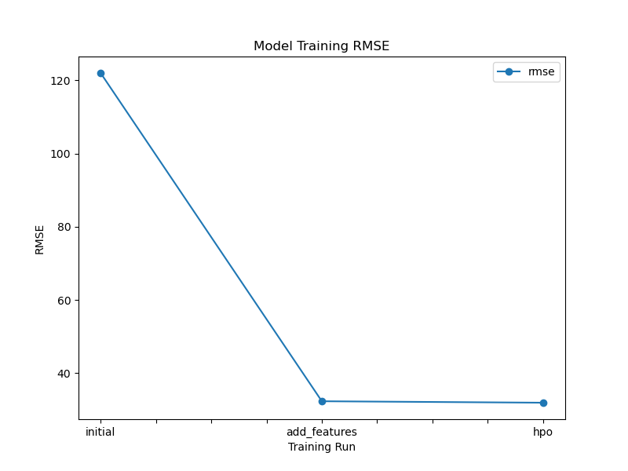
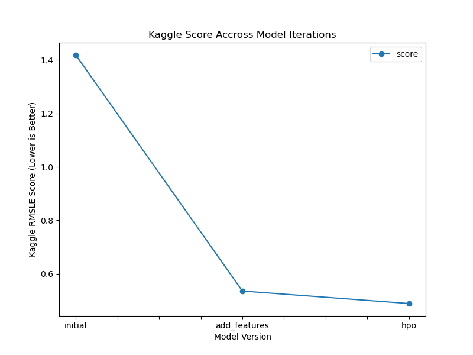

# Report: Predict Bike Sharing Demand with AutoGluon Solution
#### Elie Hatem

## Initial Training
### What did you realize when you tried to submit your predictions? What changes were needed to the output of the predictor to submit your results?
The submission gets rejected if the output of the predictor contains negative values. So before submitting, I needed to substitute the negative values by 0.

### What was the top ranked model that performed?
The top-ranked model was **WeightedEnsemble_L3_FULL**, an ensemble model that combines the predictions of several models trained at different stacking levels. 
It was produced using 5-fold bagging and one stacking level. The largest contributors to the ensemble were:
 
- ExtraTreesMSE_BAG_L2 (29.4%)
- XGBoost_BAG_L2 (17.6%)
- LightGBMXT_BAG_L1 (11.8%)
- RandomForestMSE_BAG_L2 (11.8%)
- CatBoost_BAG_L2 (11.8%)
 
Smaller contributions came from:
- LightGBM_BAG_L1 (5.9%)
- CatBoost_BAG_L1 (5.9%)
- NeuralNetTorch_BAG_L2 (5.9%)
 
This ensemble achieved the best validation RMSE of approximately **31.94**.

## Exploratory data analysis and feature creation
### What did the exploratory analysis find and how did you add additional features?
By performing EDA, I found that all non-categorical features have a normal distribution, except for the windspeed feature which is right-skewed, and the datetime column which has a uniform distribution. The datetime colum did not provide relevant information in it's raw state. However, it became much more useful after extracting the month, day and hour features, which can then be used as features instead of the datetime column to improve the performance of the model.

### How much better did your model preform after adding additional features and why do you think that is?
The model improved substantially. The validation RMSE decreased from 122 bikes to around 32.34 bikes. This means that the error was reduced by around 73.5%, computed as (122.01-32.34)/122.01.
This is due to the addition of the 3 time-based features (month, day, hour), which provided relevant information to the model about recurring time patterns, and helped improve the performance of the model. 

## Hyper parameter tuning
### How much better did your model preform after trying different hyper parameters?
The validation RMSE decreased from approximately 32.34 to 31.94, which is about 1.24%. The use of 5-fold baggging, one stacking level and the good_quality present allowed AutoGluon to build a stronger ensemble and slightly reduce the RMSE.

### If you were given more time with this dataset, where do you think you would spend more time?
I would spend more time on feature engineering, to try to find additional relationships between the existing features, which could provide more useful insights for the model and further reduce the prediction error. In addition, we can also provide AutoGluon more time to train on the data, which might also improve the performance further.

### Create a table with the models you ran, the hyperparameters modified, and the kaggle score.
|model|hpo1|hpo2|hpo3|score|
|--|--|--|--|--|
|initial|default|default|medium_quality|1.41883|
|add_features|default|default|medium_quality|0.53507|
|hpo|num_bag_folds=5|num_stack_levels=1|good_quality|0.48823|

### Create a line plot showing the top model score for the three (or more) training runs during the project.

### Create a line plot showing the top kaggle score for the three (or more) prediction submissions during the project.

## Summary
In this project, AutoGluon was used to predict bike rental demand. The initial model provided a solid baseline, but the largest performance came from feature engineering, thanks to the additional time-based features that were derived from the datetime column. The model performance was improved further through AutoGluon's bagging and stacking capabilities. 
The final model reduced the validation RMSE from approximately 122 to 32 and improved the Kaggle score from 1.41883 to 0.48823, which demonstrated the importance of feature engineering and ensemble learning for tabular machine learning problems.